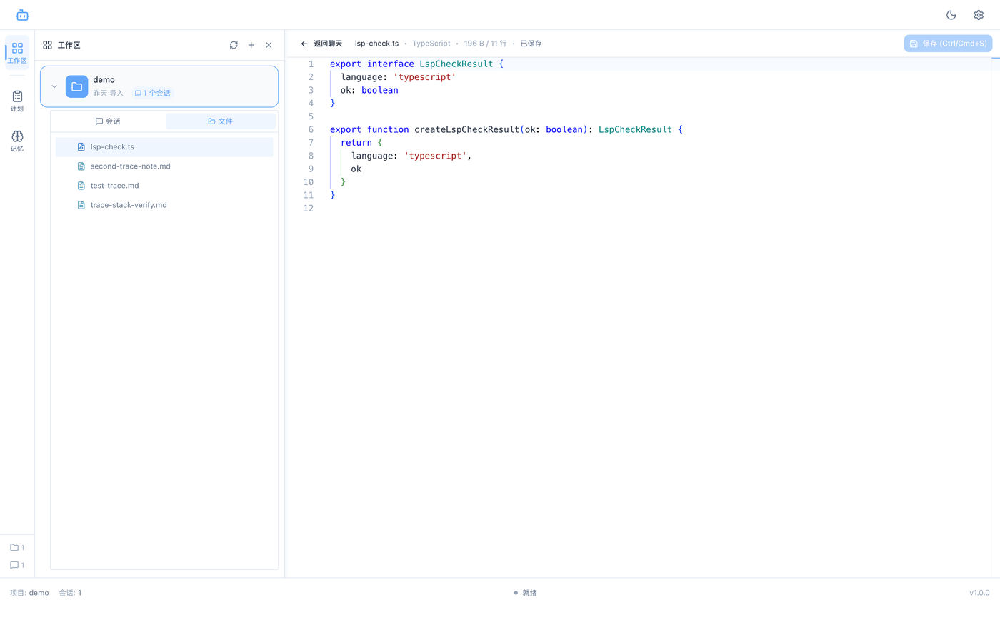
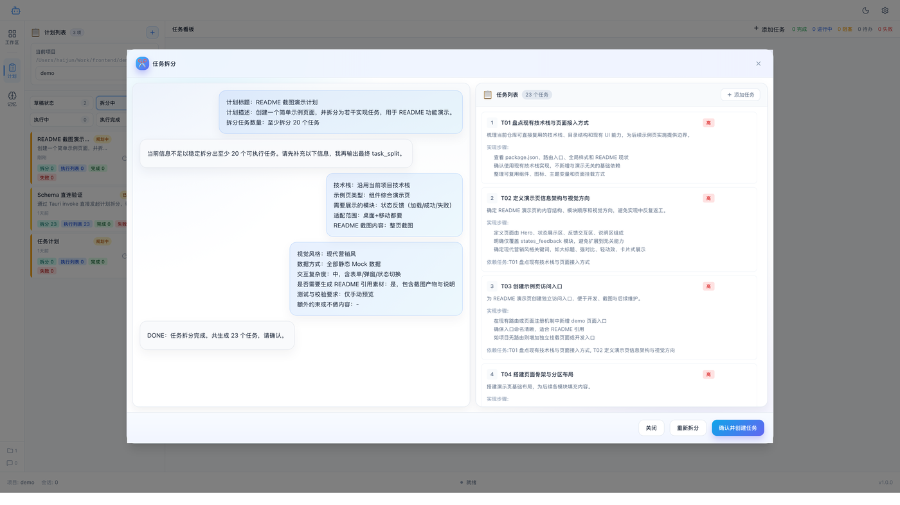
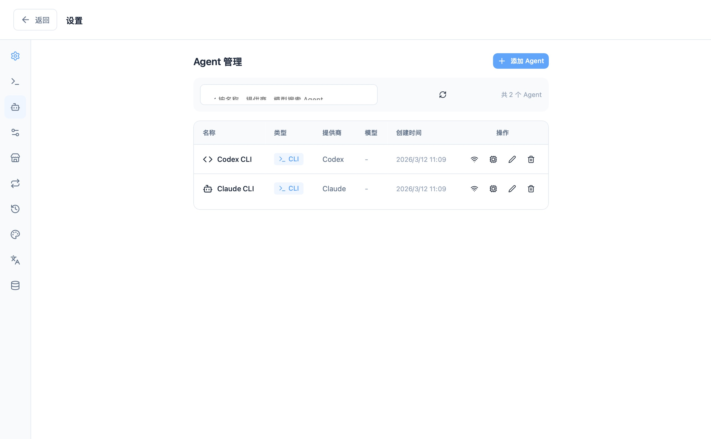
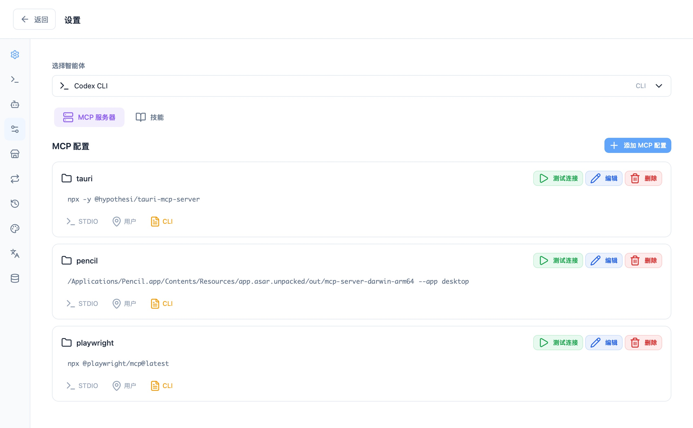
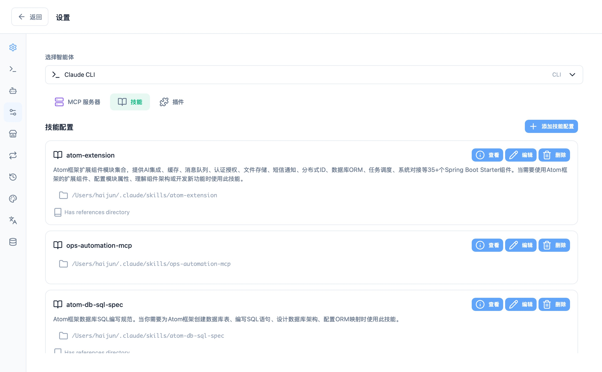
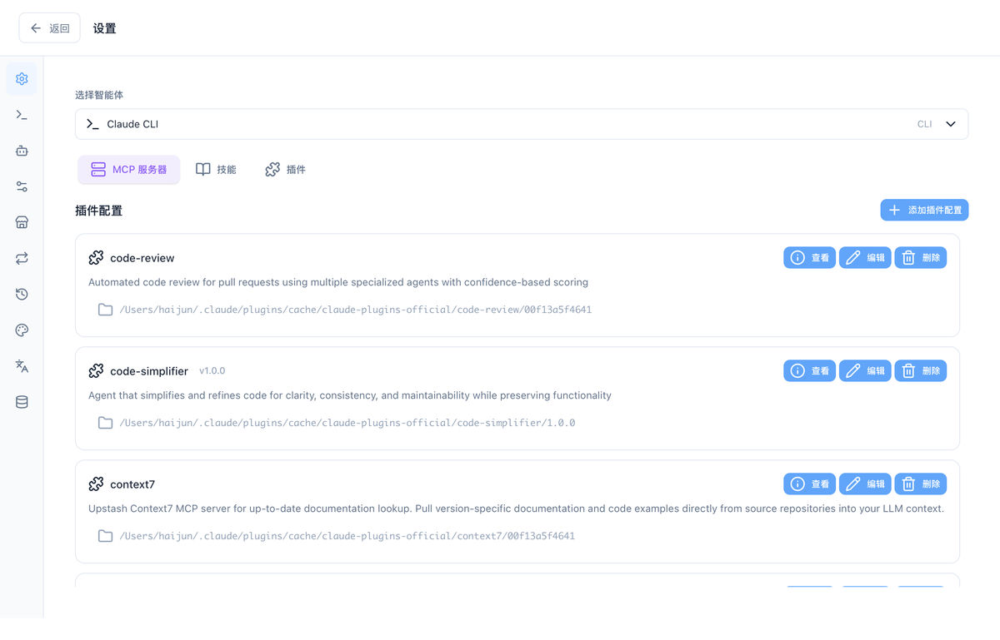
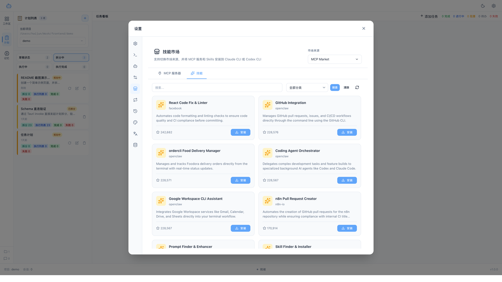

# Easy Agent Pilot

Easy Agent Pilot 是一个面向本地开发环境的 AI Agent 桌面工作台，基于 `Tauri 2 + Vue 3 + Rust + SQLite` 构建。它把项目导入、会话协作、计划拆分、任务执行、技能扩展和本地数据管理整合到同一个应用里，适合用来组织日常开发、排障、重构和交付流程。


## 软件描述

Easy Agent Pilot 不是单纯的聊天界面，而是一个围绕“项目上下文”组织 AI 协作的本地工作台：

- 项目是中心：每个项目都有自己的会话、计划、任务和数据
- 本地优先：配置、会话、计划和执行数据默认保存在本地 SQLite
- 多模式协作：工作区、计划模式、记忆管理和设置中心分工明确
- 可扩展：支持 Claude CLI、Codex CLI、MCP、Skills、Plugins 等本地集成能力

## 核心模块总览

### 1. 项目工作区

- 以本地项目为单位建立工作区
- 在同一个项目下维护多个会话、消息和上下文
- 在聊天与文件编辑之间切换，保持协作过程连续

### 2. 计划模式

- 把自然语言目标拆成结构化计划
- 管理任务状态、依赖关系和执行进度
- 通过看板视图持续跟踪任务推进

### 3. 记忆管理

- 维护 Markdown 记忆库
- 管理原始记忆记录并合并进指定记忆库
- 为不同项目挂载可复用的长期知识

### 4. 设置与扩展中心

- 管理 Claude CLI、Codex CLI 等本地工具
- 维护 Agent、MCP 服务、Skills、Plugins 和市场源
- 支持 Claude CLI / Codex CLI 集成切换、会话管理、主题与 LSP 配置

### 5. 本地数据治理

- 导出、导入和清理本地数据
- 查看数据存储位置
- 管理安装会话和运行状态

## 详细功能说明

### 1. 项目管理


功能作用：

- 把本地目录导入为独立项目
- 为每个项目隔离会话、计划、任务和数据
- 支持在多个项目之间快速切换

入口位置：

- 启动页
- 欢迎页项目列表
- 工作区左侧项目面板中的“新建项目”

常见操作：

1. 点击“导入项目”或“新建项目”。
2. 输入项目名称，或直接选择本地目录。
3. 选填项目描述。
4. 如有需要，可在创建时挂载记忆库。
5. 创建后进入该项目的工作区。

适合场景：

- 同时管理多个代码仓库
- 为不同客户项目或子产品建立隔离上下文
- 让计划、会话和扩展配置围绕项目组织

### 2. 工作区与会话协作



功能作用：

- 以项目为上下文与 Agent 持续协作
- 为不同任务建立独立会话，避免上下文混杂
- 承载需求分析、代码生成、排障和评审等过程

入口位置：

- 左侧导航“工作区”

常见操作：

1. 进入某个项目后，在会话面板新建会话。
2. 给会话命名，按主题区分用途，例如“需求拆解”“接口联调”“代码重构”。
3. 在消息区输入需求、问题或指令，与 Agent 持续协作。
4. 根据需要切换不同会话标签，保留各自上下文。
5. 在会话列表中搜索、固定、关闭或删除历史会话。

工作区内还可以做什么：

- 查看消息历史和结构化响应内容
- 在需要时切换到文件编辑视图
- 通过输入区继续追问、补充约束或追加上下文

### 3. 文件编辑工作区


功能作用：

- 直接在应用内查看和编辑项目文件
- 在聊天与代码编辑之间快速切换
- 提供语言识别、行数统计、保存状态和快捷保存

入口位置：

- 在工作区中打开项目文件后切换到编辑视图

常见操作：

1. 从项目文件树中选择需要查看的文件。
2. 进入编辑器后查看文件名、语言类型、文件大小和保存状态。
3. 修改文件内容。
4. 使用工具栏按钮或 `Ctrl/Cmd + S` 保存。
5. 点击“返回聊天”回到会话界面继续协作。

适合场景：

- 一边与 Agent 讨论，一边手动调整代码
- 快速检查生成内容是否符合预期
- 对大文件进行只读或轻量编辑

### 4. 计划模式


功能作用：

- 把一句目标拆成一个可管理的计划
- 将复杂任务拆成多个可执行子任务
- 按状态和进度管理整个交付过程

入口位置：

- 左侧导航“计划”

常见操作：

1. 进入计划模式后，选择当前项目。
2. 点击“新建计划”创建新的目标条目。
3. 填写计划标题、描述和拆分相关设置。
4. 发起任务拆分，生成结构化任务。
5. 在计划列表中切换不同计划。
6. 在看板中查看各任务状态。
7. 点击任务或计划，在右侧查看进度、详情或执行日志。



图示说明：

- AI 会先根据目标自动拆分任务；当信息不足时，会继续追问范围、风格和交付边界。
- 拆分完成后，弹框会直接展示结构化任务列表，用户可在确认前继续调整、重新拆分或直接创建任务。

计划模式更适合处理：

- 跨多个步骤的复杂需求
- 需要拆解依赖关系的交付任务
- 需要持续查看执行进度的迭代型工作

### 5. 任务看板


功能作用：

- 以看板方式组织任务生命周期
- 区分待办、进行中、完成、阻塞、失败等状态
- 让计划不只是“生成任务”，而是真正可跟踪

入口位置：

- 计划模式中部区域

常见操作：

1. 在左侧选中一个计划。
2. 在中间看板查看该计划下的所有任务。
3. 点击具体任务，打开右侧详情。
4. 关注任务的当前状态、所属角色、执行记录和时间信息。
5. 根据推进情况逐步更新或执行任务。

### 6. 记忆管理


功能作用：

- 建立可长期复用的知识库
- 把零散原始记录整理成可维护的 Markdown 记忆库
- 支持按项目筛选原始记忆并合并沉淀

入口位置：

- 左侧导航“记忆”

包含内容：

- 记忆库列表：存放长期整理后的知识内容
- 原始记忆池：存放待整理的零散记录
- 合并流程：把选中的原始记忆整理进指定记忆库

常见操作：

1. 新建记忆库，输入名称和说明。
2. 在原始记忆区新增记录，或按项目筛选已有记录。
3. 选中需要沉淀的记录。
4. 通过合并操作写入目标记忆库。
5. 在记忆库中继续维护 Markdown 内容。

适合沉淀的内容：

- 项目背景和业务规则
- 常用命令、目录约定和开发规范
- 反复出现的问题和处理经验

### 7. 通用设置


功能作用：

- 调整应用基础行为和使用习惯
- 管理语言、字体、自动保存和输入方式
- 配置编辑器和会话压缩策略

入口位置：

- 右上角设置按钮
- 设置中心“通用设置”

可配置内容包括：

- 界面语言
- 字体大小
- 自动保存和保存间隔
- 删除确认
- Enter 发送行为
- 编辑器字体大小、Tab 宽度、自动换行
- 会话压缩策略和阈值

### 8. CLI 管理


功能作用：

- 检测本机是否已安装 Claude CLI、Codex CLI 等工具
- 手动添加自定义 CLI 路径
- 管理安装、升级和版本检查

入口位置：

- 设置中心“CLI”

常见操作：

1. 打开 CLI 页面查看自动检测结果。
2. 若未识别到目标工具，手动添加可执行文件路径。
3. 使用路径验证功能确认 CLI 是否可用。
4. 按需安装或升级支持的 CLI。
5. 回到其他模块继续绑定智能体或执行协作。

### 9. 智能体管理



功能作用：

- 管理可用智能体列表
- 为不同工具维护独立智能体配置
- 组织模型与连接信息

入口位置：

- 设置中心“智能体”

常见操作：

1. 新建智能体，选择对应 CLI 或工具类型。
2. 填写名称和连接信息。
3. 根据需要维护模型列表。
4. 在列表中验证连接、编辑或删除智能体。
5. 回到工作区时选择对应智能体参与会话。

### 10. MCP / Skills / Plugins 配置

| MCP 配置 | Skills 配置 | Plugins 配置 |
| --- | --- | --- |
|  |  |  |

功能作用：

- 为指定智能体维护扩展能力
- 管理 MCP 服务配置与启停
- 管理本地 Skills 与 Plugins 的启用、查看和删除

入口位置：

- 设置中心“扩展配置”

页面结构：

- MCP 标签：配置服务、命令、参数和连接方式
- Skills 标签：管理技能目录和技能详情
- Plugins 标签：管理插件配置与详情

常见操作：

1. 先选择目标智能体。
2. 切换到 MCP、Skills 或 Plugins 标签。
3. 新增或修改对应配置。
4. 打开详情页查看内容。
5. 根据需要启用、刷新、删除或打开配置文件。

### 11. 技能市场



功能作用：

- 浏览可安装的 MCP、Skills 和 Plugins
- 统一查看市场中的描述、分类和安装入口
- 为本地智能体扩展能力来源

入口位置：

- 设置中心“技能市场”

常见操作：

1. 打开市场页后在 MCP、技能、插件之间切换。
2. 使用搜索、筛选查看目标条目。
3. 进入详情页了解说明、版本和安装信息。
4. 执行安装后回到扩展配置页继续管理。

### 12. Claude CLI / Codex CLI 集成切换


功能作用：

- 在 Claude CLI 与 Codex CLI 相关配置之间快速切换
- 适合维护多套本地 AI 开发环境

入口位置：

- 设置中心“配置切换”

适合场景：

- 同时维护 Claude CLI 与 Codex CLI
- 为不同项目切换不同的本地 CLI 配置
- 区分个人常用配置与临时实验配置

### 13. 会话管理


功能作用：

- 统一查看历史 CLI 会话
- 按项目或智能体筛选旧会话
- 批量清理不再需要的运行记录

入口位置：

- 设置中心“会话管理”

常见操作：

- 查看历史会话详情
- 按条件筛选会话
- 删除单条或批量删除陈旧会话

### 14. 数据管理


功能作用：

- 导出本地数据用于备份
- 导入数据用于迁移
- 清空本地状态重新开始
- 管理安装会话和中间记录

入口位置：

- 设置中心“数据管理”

常见操作：

1. 在导出区域勾选要导出的数据类型。
2. 选择保存路径，导出为 JSON 文件。
3. 在导入区域选择已有备份文件并执行导入。
4. 如需清理环境，在确认后执行清空数据。
5. 在安装会话区查看未完成或历史安装记录。

适合场景：

- 更换设备时迁移数据
- 定期备份本地工作状态
- 重置环境或清理历史残留

## 推荐使用流程

### 1. 首次启动时完成基础准备

启动后先进入欢迎页，可以直接导入项目或进入设置中心完成基础配置。

建议先完成：

- 检查 CLI 是否已识别
- 新建或确认智能体配置
- 按需补充扩展能力

### 2. 导入或选择项目

选择本地目录后，项目会成为会话、计划、任务和数据管理的统一上下文。

### 3. 在工作区创建会话

进入项目后，先建立一个会话开始需求分析、问题定位或任务说明。

建议做法：

- 一个需求用一个会话
- 一个问题排查过程用一个会话
- 一个代码改造主题用一个会话

### 4. 切换到计划模式

当需求需要进一步结构化时，可以进入计划模式创建计划、拆分任务，并在看板中查看执行状态。

### 5. 打开设置中心完善环境

建议按需完成以下配置：

- 检查 CLI 工具是否已识别
- 配置 Agent 和模型
- 安装或启用 MCP、Skills、Plugins
- 根据当前任务切换 Claude CLI 或 Codex CLI 配置

### 6. 在记忆管理中沉淀长期知识

当项目背景、规范或经验需要长期复用时，可以把它们整理进记忆库，供后续项目协作复用。

### 7. 定期管理本地数据

在数据管理页可以查看数据目录，执行导出、导入或清理操作，方便备份和迁移。

## 适用场景

- 本地代码项目的 AI 协作开发
- 需求拆解、任务分配和进度追踪
- 多模型、多 CLI、多扩展能力并行管理
- 需要本地持久化和可迁移数据的桌面端工作流

## 快速开始

### 运行环境

- Node.js 18+
- pnpm
- Rust
- Tauri 2 构建依赖

### 本地开发

```bash
pnpm install
pnpm tauri dev
```

### 构建桌面应用

```bash
pnpm tauri build
```

## 项目结构

```text
easy-agent-pilot/
├── src/                # Vue 前端界面
├── src-tauri/          # Rust / Tauri 后端
├── images/             # README 截图资源
└── README.md
```

## 技术栈

- Tauri 2
- Vue 3
- TypeScript
- Rust
- SQLite
- Pinia
